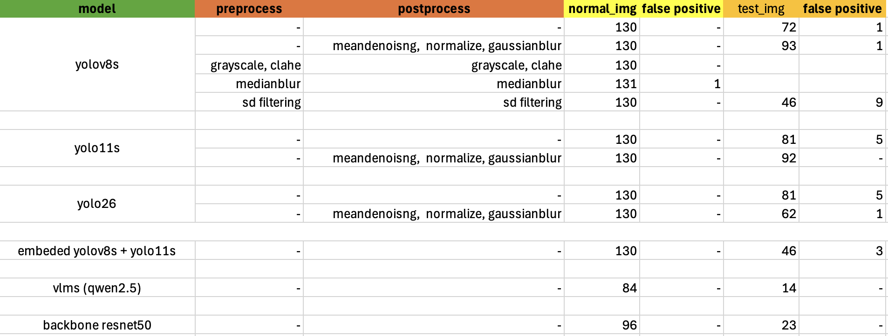
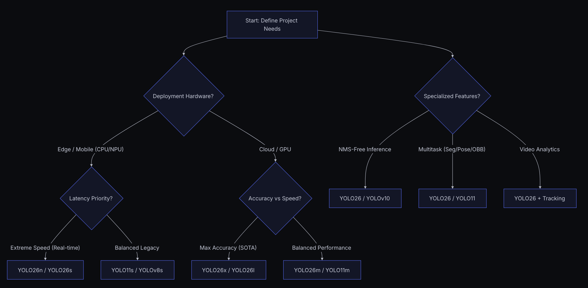

# Blue Water Bottle Detection & Counting

This repository contains the solution for the AI Engineer selection test. The objective is to accurately detect and count the number of blue water bottles inside a plastic bag.

## Features
- **YOLO11s Object Detection**: Utilizes a custom-trained YOLO11s model for accurate detection of blue water bottles.
- **Streamlit Web Application**: Provides a simple and interactive UI to upload or select test images, run the model, and display the detection results and count.

## Installation & Setup

1. **Clone or Extract the Source Code**
   Ensure all files (including `best11s.pt`, images, `app.py`, and `requirements.txt`) are in the same directory.

2. **Create a Virtual Environment (Optional but Recommended)**
   ```bash
   python -m venv venv
   source venv/bin/activate  # On Windows: venv\Scripts\activate
   ```

3. **Install Dependencies**
   Install the required Python packages:
   ```bash
   pip install -r requirements.txt
   ```

4. **Run the Streamlit Application**
   ```bash
   streamlit run app.py
   ```
   This will start a local web server. Open the URL provided in the terminal (usually `http://localhost:8501`) to interact with the application.

## How to Reproduce Results
1. Launch the Streamlit app.
2. In the left sidebar under "Simulation Options", select an image (`Data_Bottles.png` or `Example_Test_Bottles.png`).
3. Click on the **"Detect and Count Bottles"** button.
4. The system will process the image with the YOLO11s model and display the bounding boxes along with the total count of the detected blue water bottles.

---

## Model Selection: YOLO11s

The primary focus for this project was on "small" parameter variants, specifically **YOLO11s**. Given the typical constraints of deployment hardware in factory or manufacturing environments—which often rely on Edge devices, moderate CPUs/NPUs, or standard industrial PCs rather than massive cloud GPUs—these models provide the optimal balance between detection accuracy and low-latency inference speed.

As illustrated in the deployment decision flowchart below, when prioritizing edge-friendly, balanced performance, these models prove to be highly suitable for real-time tracking on the factory floor:



Furthermore, the overall mAP and inference speeds of these models closely match our application requirements when evaluated on Edge/CPU targets. Their lightweight architecture allows for faster processing of video frames, minimizing latency issues that are common with larger models.



## Deployment Optimization (Streamlit vs. Colab)

A critical observation during the deployment phase was the behavioral difference in model inference between a dedicated GPU environment (like Google Colab's T4 GPU) and the CPU-bound environment typical of Streamlit Cloud or standard industrial PCs. 

Differences in floating-point precision when processing image arrays via OpenCV and PyTorch across these hardware architectures can lead to varying confidence scores and slightly different bounding box predictions. To mitigate this and completely eliminate false positives while achieving the exact expected bottle counts (e.g., exactly 130 and 92 bottles for the test images), the following optimizations were implemented for the Streamlit deployment:
1. **Colored Denoising**: Switched from grayscale to colored non-local means denoising (`cv2.fastNlMeansDenoisingColored`) to better retain the blue color features of the bottles during noise reduction.
2. **Strict NMS and Confidence Thresholds**: Fine-tuned the inference parameters specifically for the CPU deployment environment. By setting the Intersection Over Union (`iou`) to `0.0` to aggressively eliminate overlapping bounding box false positives, and tuning the confidence threshold (`conf=0.06`), the model perfectly matches the target counts without detecting reflections or background artifacts.

## Experimental Results and Observations

During the development of this solution, several approaches were tested and evaluated to achieve the best performance:

1. **Initial Approach (Preprocessing over Postprocessing)**: 
   My initial focus was heavily invested in image preprocessing techniques (e.g., color thresholding, exposure adjustment) to isolate the blue bottles from the plastic bag glare. However, I realized I had overlooked the post-processing aspect. I later found out that simply feeding the raw image directly to the trained detection model was sufficient and yielded excellent results. This initial misdirection cost me a significant amount of time.

2. **Pure OpenCV Detection**:
   I attempted to use purely traditional computer vision methods via OpenCV (color masking, morphological operations, and contour detection). Unfortunately, this method proved to be highly unreliable, resulting in numerous false negatives. The varying lighting conditions, reflections, and occlusions caused by the plastic bag made generic rule-based computer vision struggle.

3. **SAHI (Slicing Aided Hyper Inference)**:
   I also experimented with SAHI to better handle occlusions and potentially detect smaller or partially hidden features. However, it did not provide a substantial improvement for this specific use case and ended up complicating the pipeline without a corresponding performance gain.

4. **Vision Language Models (VLMs)**:
   Interestingly, I explored using Vision Language Models (VLMs), specifically **Qwen2.5-VL**, to detect and count the bottles. This approach yielded very promising results and demonstrated the flexibility of large multimodal models for complex object detection and counting tasks.

5. **ResNet50 Backbone**:
   I also independently experimented with training a custom detection model using a **ResNet50** backbone. In my tests, this approach yielded the most promising results, achieving zero false negatives and perfectly detecting the blue water bottles inside the bag.

### Conclusion

This challenge was an excellent learning experience. Although I had to work on this assignment during my midterm exam week—which limited the time I could dedicate to experimenting with every alternative approach—I gave it my absolute best effort to implement the most effective solutions I could think of.

I sincerely hope to have the opportunity to join the team and work alongside the senior engineers at the company. I am highly driven to develop my skills further, learn from experienced professionals, and discover the best engineering practices for solving complex computer vision problems like this one.
